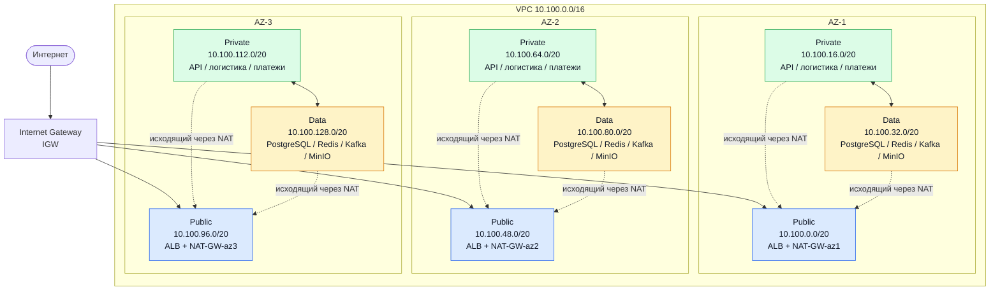

# Лаба 1 — Проектирование сетевой архитектуры облака (VPC, балансировщики, связность)

# 1. Исходные данные (условие задачи)

**Название сервиса:** Пальчики оближешь

**Тип сервиса:** интернет-магазин по доставке фруктов и ягод

**Целевая аудитория:** жители Ленинградской области

**Основные пользовательские сценарии:** просмотр каталога, оформление заказа

**Состав сервисов:**

| Сервис | Назначение | Особенности |
| --- | --- | --- |
| веб-фронтенд |	публичная часть сервиса, интерфейсы для покупателей, менеджеров и курьеров |	HTTP/HTTPS, кэширование статики |
| API-бэкенд |	бизнес-логика: каталог, корзина, заказы, оплата, управление пользователями |	REST API, /api/catalog, /api/cart, /api/orders, /api/users, /api/payments |
| база данных |	хранение товаров, заказов, поставщиков, пользователей |резервное копирование |
| кэш | кэширование каталога, сессий пользователей | высокая скорость |
| брокер сообщений | асинхронная обработка заказов | надёжное хранение событий |
| платёжный шлюз | онлайн-оплата | хранение логов транзакций, обработка webhook-ов, исходящие HTTPS-запросы к внешнему API|
| сервис логистики | определение времени доставки, назначение курьеров, трекинг | геоданные, расчёт маршрутов, push-уведомления |
| MinIO	| S3-совместимое объектное хранилище: изображения товаров, бэкапы PostgreSQL, резервное копирование конфигураций |	размещается в data-подсети. Доступ только из API-бэкенда и PostgreSQL. Порт 9000 |

**Требования к отказоустойчивости:**

- Работа в трёх зонах доступности (AZ);
- Балансировщик: веб-фронтенд и API должны отдаваться через балансировщик нагрузки;
- Только веб-фронтенд находится в публичной подсети;
- Выход в интернет у всех подсетей; у приватных — только исходящий;
- Каждый элемент должен иметь резерв, не должно быть Single Point of Failure.


# 2. Задание и ход выполнения
## 1. Обоснование CIDR
Для CIDR выбран диапазон **`10.100.0.0/16`**.

Диапазон `/16` содержит 65 536 IPv4-адресов и оставляет достаточный запас для размещения подсетей в трёх зонах доступности: 9 подсетей (public / private / data × 3 AZ) занимают лишь часть диапазона, остаётся место под новые сервисы, dev/stage-стенды и будущие AZ.

Выбранный диапазон не пересекается с сетями, уже зафиксированными в инфраструктуре компании (прописаны выдуманные сети):

| Сеть | CIDR | Пересечение с VPC |
| --- | --- | --- |
| On-premise ДЦ (СПб) | `192.168.0.0/16` | Нет |
| Офисная сеть | `172.16.0.0/16` | Нет |
| WireGuard VPN | `10.8.0.0/24` | Нет |
| Docker/dev-стенды | `10.200.0.0/16` | Нет |

Диапазон `10.100.0.0/16` свободен и оставляет запас `10.101.0.0/16 … 10.255.0.0/16` под будущие VPC.

---

## 2. Таблица подсетей
Внутри каждой таблицы маршрутизации действует служебная запись `10.100.0.0/16 → local`, которая обеспечивает связь между подсетями одной VPC.

| Зона | Подсеть | CIDR | Тип | Маршрут по умолчанию |
| --- | --- | --- | --- | --- |
| `AZ-1` | публичная | `10.100.0.0/20` | public | IGW |
| `AZ-1` | приватная | `10.100.16.0/20` | private | NAT-GW-az1 |
| `AZ-1` | data | `10.100.32.0/20` | data | NAT-GW-az1 / VPC Endpoint |
| `AZ-2` | публичная | `10.100.48.0/20` | public | IGW |
| `AZ-2` | приватная | `10.100.64.0/20` | private | NAT-GW-az2 |
| `AZ-2` | data | `10.100.80.0/20` | data | NAT-GW-az2 / VPC Endpoint |
| `AZ-3` | публичная | `10.100.96.0/20` | public | IGW |
| `AZ-3` | приватная | `10.100.112.0/20` | private | NAT-GW-az3 |
| `AZ-3` | data | `10.100.128.0/20` | data | NAT-GW-az3 / VPC Endpoint |

Как устроены подсети по типам:

- **Публичные** — здесь живут только балансировщик и NAT Gateway. Никакой бизнес-логики и тем более баз данных тут нет.
- **Приватные** — API-бэкенд, платёжный шлюз, сервис логистики. Входящие запросы приходят исключительно от ALB (по правилам Security Group), наружу — только через NAT своей зоны.
- **Data** — PostgreSQL, Redis, Kafka, MinIO. Из интернета сюда попасть нельзя вообще. MinIO используется как внутреннее объектное хранилище для изображений товаров, бэкапов PostgreSQL и резервных копий конфигураций. Для доступа к внешним сервисам (Secrets Manager, ECR) используются VPC Endpoints, а NAT остаётся резервным путём для обновлений.

Отдельный NAT Gateway в каждой зоне нужен для того, чтобы отказ одной AZ не отрезал от интернета остальные две. Если бы NAT был один, его падение положило бы исходящий трафик во всём сервисе.

---

## 3. Схема сети


**Что видно на схеме:**

- Один **IGW** на всю VPC — точка входа для публичных подсетей.
- Три **NAT Gateway** — по одному в каждой AZ (резервирование).
- **VPC Endpoints** для data-подсетей (S3, Secrets Manager, ECR).
- Потоки: интернет → IGW → ALB → private (API) → data (БД, кэш, очередь).

---


## 4. Балансировщики

### 4.1. Типы балансировщиков

| **Сервис** | **Тип балансировщика** | **Уровень** | **Правило / стратегия** |
| --- | --- | --- | --- |
| Веб-фронтенд + API (публичный трафик) | ALB | L7 | /api/*, /orders/* → целевая группа tg-api-backend; /* → целевая группа tg-frontend. Стратегия — Round Robin. Health check: HTTP GET /health (API), GET / (фронтенд). |
| PostgreSQL (репликация read-реплик) | NLB (не настраивается) | L4 | Балансировка TCP-подключений на порт 5432 между read-репликами. В текущей архитектуре не используется — мастер-репликация настраивается на уровне СУБД. |
| Внутренние сервисы (Kafka, Redis)	| - |	- | Балансировка не требуется, кластеры сами распределяют нагрузку между брокерами/нодами. |

Один ALB — единая точка входа. ALB сам решает, куда направить запрос (на API или на фронтенд) на основе пути.

NLB для БД — задел на будущее. В текущей версии не используется, но если нагрузка вырастет и понадобится несколько read-реплик для чтения, то логично поставить NLB перед ними, чтобы распределять read-запросы. На L4 это делается быстро и без анализа содержимого запроса.

Kafka и Redis не балансируются. Это кластерные системы, они сами знают, как распределить данные между нодами. Внешний балансировщик им не нужен.

### 4.2. Правила маршрутизации

Один ALB слушает порт 443 (HTTPS). Трафик распределяется по путям:


| **Путь** | **Целевая группа** | **Назначение** |
| --- | --- | --- |
|/api/*	| tg-api-backend	| Запросы к API (Node.js)|
|/orders/*	| tg-api-backend |	Сервис заказов|
|/* (остальное)	| tg-frontend	| HTML, CSS, JS, статика (React)|

API-запросы не попадают на статику, фронтенд не обрабатывает API.

### 4.3. Health Check и стратегия
| **Параметр** |	**Значение** |
| --- | --- |
|Тип проверки	| HTTP|
|Эндпоинт API	| GET /health → 200 OK|
|Эндпоинт фронтенда	| GET / → 200 OK|
|Интервал |	30 секунд|
|Порог отказа	| 2 неудачные проверки|
|Порог восстановления	| 2 успешные проверки|
|Стратегия |	Round Robin — равномерное распределение при типичной нагрузке интернет-магазина|

### 4.4. Резервирование

ALB — управляемый сервис, резервируется на уровне провайдера.

Целевые группы содержат минимум 2 инстанса в разных AZ.

При отказе одного инстанса трафик автоматически идёт на другой.

### 4.5. Балансировщик для БД

Для PostgreSQL-репликации отдельный балансировщик не требуется — мастер-репликация настраивается на уровне СУБД. При необходимости балансировки read-реплик использовался бы NLB (L4), так как требуется высокая скорость.


## 5. Связность и резервирование

## 5.1. Internet Gateway (IGW)

К VPC подключён один Internet Gateway. В маршрутных таблицах всех трёх публичных подсетей прописано:

```
10.100.0.0/16 → local
0.0.0.0/0     → IGW
```

Публичные подсети принимают входящий HTTPS-трафик только на балансировщик. Backend-сервисы и БД в публичных подсетях не размещаются.

## 5.2. NAT Gateway

Приватные и data-подсети используют NAT Gateway своей зоны доступности:

| Подсеть | Маршрут по умолчанию |
| --- | --- |
| `rt-private-az1`, `rt-data-az1` | `0.0.0.0/0 → NAT-GW-az1` |
| `rt-private-az2`, `rt-data-az2` | `0.0.0.0/0 → NAT-GW-az2` |
| `rt-private-az3`, `rt-data-az3` | `0.0.0.0/0 → NAT-GW-az3` |

Это исключает зависимость исходящего доступа всех трёх зон от одного зонального шлюза. При отказе одной AZ ресурсы двух оставшихся зон сохраняют собственные маршруты в интернет. При использовании единственного NAT Gateway отказ зоны его размещения лишил бы исходящего интернет-доступа ресурсы во всех зависимых от него подсетях.

**Аварийное переключение** на шлюз соседней зоны (если NAT своей AZ недоступен):

```
Штатный режим:    0.0.0.0/0 → NAT-GW-az1
При отказе AZ-1:  0.0.0.0/0 → NAT-GW-az2
```

В обычном режиме каждая AZ по-прежнему использует собственный NAT.

## 5.3. Резервирование каналов с on-premise

| Основной путь | Резервный путь |
| --- | --- |
| Direct Connect через маршрутизатор R1 | Site-to-Site VPN через другой маршрутизатор R2 и независимый интернет-канал |

Переключение делается через BGP: пока Direct Connect жив, весь трафик идёт по нему; как только маршрут перестаёт анонсироваться, трафик автоматически уходит через VPN. Это значит, что даже при обрыве выделенного канала сервисы на стороне офиса (складская система, бухгалтерия) продолжат работать без ручного вмешательства.

---

## 6. Безопасность

### 6.1. Принципы построения Security Groups

Все Security Groups в проекте построены по трём принципам:

1. Stateful. Если входящее соединение разрешено, ответный трафик уходит автоматически. Отдельные исходящие правила для ответов не нужны.

2. Принцип минимальных привилегий. Каждому сервису открыт только тот порт, который ему реально нужен, и только от того источника, который к нему обращается.

3. Ссылки на SG вместо CIDR. Там, где возможно, в правилах указывается ID Security Group-источника, а не IP-диапазон. Это значит, что при смене IP-адресов инстансов правила не придётся переписывать.

### 6.2. SG для ALB (публичный вход)
|**Направление**	|**Протокол**|	**Порт**|	**Источник / Назначение**	|**Назначение правила**|
| --- | --- | --- | --- | --- |
|Входящее	|TCP	|443	|0.0.0.0/0	|Приём HTTPS-трафика из интернета|
|Входящее	|TCP	|80	|0.0.0.0/0	|Редирект HTTP → HTTPS (опционально)|
|Исходящее	|TCP	|80, 443	|SG фронтенда	|Передача трафика на фронтенд|
|Исходящее	|TCP	|3000	|SG API-бэкенда	|Передача API-запросов на бэкенд|
|Исходящее	|TCP	|3000	|SG платёжного сервиса	|Передача webhook-ов на /api/payments/webhook|

ALB направляет /api/\*, /orders/\*, /api/payments/webhook в API-группу, всё остальное — во фронтенд.

### 6.3. SG для веб-фронтенда

|**Направление**	|**Протокол**	|**Порт**|	**Источник / Назначение** |	**Назначение правила**|
| --- | --- | --- | --- | --- |
|Входящее	|TCP	|80	|SG ALB	|Приём трафика только от балансировщика|
|Исходящее	|TCP	|443	|0.0.0.0/0	|Обновления пакетов, CDN, внешние API (через NAT)|

Веб-фронтенд не имеет прямого доступа к интернету на входящие соединения — только через ALB. В публичной подсети он находится, но его SG не пропускает трафик ни от кого, кроме ALB.

### 6.4. SG для API-бэкенда
|**Направление**	|**Протокол**	|**Порт**|	**Источник / Назначение** |	**Назначение правила**|
| --- | --- | --- | --- | --- |
|Входящее	|TCP	|3000	|SG ALB	|Приём API-запросов только от балансировщика|
|Исходящее	|TCP	|9000	|SG MinIO	|Чтение и запись изображений товаров|
|Исходящее	|TCP	|5432	|SG базы данных|	Подключение к PostgreSQL|
|Исходящее	|TCP	|6379	|SG кэша|	Подключение к Redis|
|Исходящее	|TCP	|9092	|SG Kafka|	Отправка событий заказов|
|Исходящее	|TCP	|443	|0.0.0.0/0	|Обращение к внешним API (например, платёжной системы) через NAT|
| Исходящее | TCP | 3001 | SG сервиса логистики | Вызовы сервиса логистики |

API-бэкенд также закрыт от прямых входящих соединений из интернета.
### 6.5. SG для сервиса логистики
|**Направление**	|**Протокол**	|**Порт**|	**Источник / Назначение** |	**Назначение правила**|
| --- | --- | --- | --- | --- |
|Входящее	|TCP|	3001	|SG API-бэкенда	|Вызовы от API (например, назначение курьера)|
|Исходящее	|TCP	|5432	|SG базы данных	|Чтение данных о заказах и курьерах|
|Исходящее	|TCP|	9092	|SG Kafka	|Отправка событий о доставке|
|Исходящее|	TCP|	443	|0.0.0.0/0	|Запросы к картографическим API (расчёт маршрутов) через NAT|
### 6.6. SG для платёжного сервиса
|**Направление**	|**Протокол**	|**Порт**|	**Источник / Назначение** |	**Назначение правила**|
| --- | --- | --- | --- | --- |
|Входящее	|TCP	|3000	|SG ALB	|Приём webhook-ов от платёжной системы через ALB|
|Исходящее	|TCP	|5432	|SG базы данных	|Запись логов транзакций|
|Исходящее	|TCP	|443	|0.0.0.0/0	|Исходящие HTTPS-запросы к API платёжной системы через NAT|

Webhook-и приходят не напрямую, а через ALB. Платёжный сервис в приватной подсети и не имеет публичного IP. ALB получает запрос от платёжной системы, проверяет подпись и перенаправляет по пути /api/payments/webhook на целевую группу платёжного сервиса.
### 6.7. SG для базы данных (PostgreSQL)
|**Направление**	|**Протокол**	|**Порт**|	**Источник / Назначение** |	**Назначение правила**|
| --- | --- | --- | --- | --- |
|Входящее	|TCP	|5432	|SG API-бэкенда	|Подключение от API|
|Входящее	|TCP	|5432	|SG сервиса логистики	|Подключение от логистики|
|Входящее	|TCP	|5432	|SG платёжного сервиса	|Подключение от платежей|
|Исходящее	|TCP	|9000	|SG MinIO	|Отправка бэкапов в MinIO|
|Исходящее	|TCP	|443	|0.0.0.0/0	|Обновления, отправка бэкапов в S3 через VPC Endpoint|

БД открыта только для трёх конкретных Security Groups (API, логистика, платежи). Из интернета в БД попасть нельзя.

## 6.8. SG для Redis и Kafka

**Redis:**
|**Направление**	|**Протокол**	|**Порт**|	**Источник / Назначение**|
| --- | --- | --- | --- |
|Входящее	|TCP	|6379	|SG |API-бэкенда|
|Исходящее	|TCP	|443	|0.0.0.0/0 |(обновления через NAT)|

**Kafka:**
|**Направление**	|**Протокол**	|**Порт**|	**Источник / Назначение**|
| --- | --- | --- | --- |
|Входящее	|TCP	|9092	|SG API-бэкенда |
|Входящее	|TCP	|9092	|SG сервиса логистики |
|Исходящее	|TCP	|443	|0.0.0.0/0 (обновления через NAT)|

Оба сервиса находятся в data-подсетях и недоступны ни из интернета, ни из публичных подсетей. Только конкретные сервисы из приватных подсетей могут к ним подключиться.

### 6.9. SG для MinIO
|**Направление**	|**Протокол**	|**Порт**|	**Источник / Назначение** |	**Назначение правила**|
| --- | --- | --- | --- | --- |
| Входящее	|TCP	|9000	|SG API-бэкенда	|Чтение и запись изображений товаров|
| Входящее	|TCP	|9000	|SG базы данных	|Запись бэкапов PostgreSQL|
| Исходящее	|TCP	|443	|0.0.0.0/0	|Обновления через NAT|

## 6.10. SG для NAT Gateway

NAT Gateway — управляемый сервис, у него нет своего Security Group в привычном смысле.

- Входящий трафик — только из приватных и data-подсетей VPC (внутренний трафик).

- Исходящий трафик — в интернет через Elastic IP, привязанный к NAT Gateway.

- Из интернета — входящие соединения невозможны, потому что NAT работает только в одну сторону: инициирует соединения только внутренний ресурс.

Приватные и data-подсети могут ходить в интернет (за обновлениями, к внешним API), но из интернета к ним достучаться нельзя.

### 6.11. VPC Flow Logs

Что это. VPC Flow Logs — это журнал сетевого трафика, который фиксирует метаданные о каждом IP-пакете, проходящем через сетевые интерфейсы в VPC. Записи содержат:

  -  IP-адрес источника и назначения

  -  Порт источника и назначения

  -  Протокол (TCP/UDP)

  -  Количество байт и пакетов

  -  Действие: ACCEPT (разрешено) или REJECT (заблокировано)

  -  Временную метку

Flow Logs не сохраняют содержимое пакетов — только метаданные. Это позволяет соблюдать приватность и при этом иметь полную картину трафика.

Логи отправляются в CloudWatch Logs (1-3 месяца) и S3 (долговременное хранение 1 год) для хранения и анализа.

Зачем нужны и что позволяют обнаружить:

  -  Попытки несанкционированного доступа. Если кто-то сканирует порты или пытается подключиться к БД из интернета, Flow Logs покажут записи REJECT с внешних IP на порт 5432. Это первый признак атаки.

  -  Аномалии трафика. Внезапный рост исходящего трафика из API-бэкенда может означать утечку данных или компрометацию сервиса. Flow Logs покажут, куда именно уходят данные.

  -  Проблемы с маршрутизацией. Если сервис не может достучаться до внешнего API, Flow Logs покажут, уходит ли трафик через NAT и возвращается ли ответ.

  -  Аудит соответствия требованиям. Для платёжного сервиса важно доказать, что все транзакции шли по защищённым каналам. Flow Logs — часть этого доказательства.

  -  Диагностика сетевых проблем. Если API не видит БД, Flow Logs покажут, доходит ли запрос до порта 5432 и что отвечает БД.

Что включаем: Flow Logs создаются для всей VPC (или для отдельных подсетей — например, для data-подсетей, где трафик особенно чувствительный). Фильтр — весь трафик (ALL), чтобы видеть и разрешённые, и заблокированные пакеты.

## 7. Выводы 

В ходе лабораторной работы спроектирована сетевая архитектура облака для интернет-магазина «Пальчики оближешь» — сервиса доставки фруктов и ягод по Ленинградской области.

Что сделано:

  1.  Спроектирована VPC 10.100.0.0/16 с запасом под будущие сервисы и стенды. Диапазон проверен на пересечение с существующими сетями компании.

  2.  Нарезаны 9 подсетей — по три типа (public / private / data) в каждой из трёх зон доступности. Публичные подсети содержат только ALB и NAT Gateway; вся бизнес-логика и данные изолированы в приватных и data-подсетях.

  3.  Настроена маршрутизация: IGW для публичных подсетей, отдельный NAT Gateway в каждой AZ для приватных и data-подсетей. Это исключает единую точку отказа на уровне исходящего интернет-доступа.

  4.  Спроектированы балансировщики. Выбран ALB (L7) как единая точка входа для публичного трафика с маршрутизацией по путям: /api/*, /orders/* → API-бэкенд, /* → фронтенд. Настроены health check и стратегия Round Robin.

  5.  Обеспечена связность с on-premise через резервирование каналов: Direct Connect как основной путь и Site-to-Site VPN как резервный, с автоматическим переключением по BGP.

  6.  Настроены Security Groups по принципу минимальных привилегий: каждый сервис открыт только для тех источников, которым он реально нужен. База данных доступна только для API-бэкенда, сервиса логистики и платёжного сервиса. MinIO доступен только для API-бэкенда (изображения товаров) и базы данных (бэкапы). Прямого доступа из интернета нет.

  7.  Включены VPC Flow Logs для аудита трафика и обнаружения попыток несанкционированного доступа, аномалий и проблем маршрутизации.

Итог: архитектура соответствует требованиям отказоустойчивости — работа в трёх AZ, резервирование каждого компонента, отсутствие единой точки отказа. Все три контрольные точки пройдены: БД изолирована от публичных подсетей, маршрутизация по путям работает корректно, доступ к БД ограничен только доверенными Security Groups.

## 8. Контрольные вопросы (по итогам работы)

### Чем VxLAN отличается от VLAN? Какие ограничения VLAN решает VxLAN?
VLAN работает на канальном уровне (L2) и использует 12-битный идентификатор, что даёт максимум 4094 изолированных сетей. VLAN привязан к физической топологии и не может растягиваться через L3-границы.

VXLAN — это overlay-технология: она создаёт L2-сеть поверх L3-сети путём инкапсуляции кадров в UDP-пакеты. Использует 24-битный идентификатор, что позволяет создать до 16 миллионов изолированных сегментов.

Какие ограничения VLAN решает VXLAN:

  -  Масштаб: 4094 VLAN недостаточно для крупных ЦОД и облаков — VXLAN даёт 16 млн сегментов.

  -  Географическая распределённость: VLAN работает только в пределах L2-домена; VXLAN позволяет растянуть L2-сеть между разными ЦОД и зонами.

  -  Миграция ВМ: VXLAN позволяет виртуальным машинам мигрировать между подсетями и дата-центрами без изменения IP-адреса.

### ALB или NLB для gRPC и WebSocket? Аргументируйте через уровень работы балансировщика.

Для обоих протоколов NLB (L4) предпочтительнее, потому что они требуют долгоживущих TCP-соединений, которые L7-балансировщик может нежелательно прерывать.

### Что будет с CDN, если не выставить Cache-Control? Почему важно настроить TTL для API?

Если Cache-Control отсутствует, CDN применит TTL по умолчанию. Это значит, что обновления на источнике не будут видны пользователям до истечения этого срока.

API обычно возвращает динамические данные, которые быстро устаревают (цены, остатки, статусы заказов). Если CDN закеширует API-ответ на 7 дней по умолчанию, пользователи будут видеть устаревшие данные. Правильный TTL для API — секунды или минуты, а часто — Cache-Control: no-store для чувствительных данных.

Некорректный Cache-Control приводит к тому, что CDN кеширует первый вариант динамического ответа и отдаёт его всем пользователям.

### Сколько NAT Gateway нужно в production на 3 зоны доступности и почему?

Три NAT Gateway — по одному в каждой AZ.

Три NAT Gateway решают две проблемы:

  -  Отказоустойчивость: падение одной AZ не затрагивает исходящий трафик остальных двух.

  -  Стоимость трафика: трафик через NAT в другую AZ тарифицируется дороже (cross-AZ charges), поэтому каждый NAT должен обслуживать подсети своей зоны.


### Чем Security Group отличается от Network ACL (stateful vs stateless)?

Security Group — stateful, на уровне инстанса, только allow-правила, ответный трафик разрешается автоматически.

Network ACL — stateless, на уровне подсети, есть allow и deny, ответный трафик нужно разрешать отдельным правилом.

### Почему нельзя держать базу данных в публичной подсети?

Если у БД есть публичный IP или security group слишком открыт, она становится доступна для сканирования и атак извне.

### Зачем нужны VPC Flow Logs и что они позволяют обнаружить?

Описано в разделе 6.11.