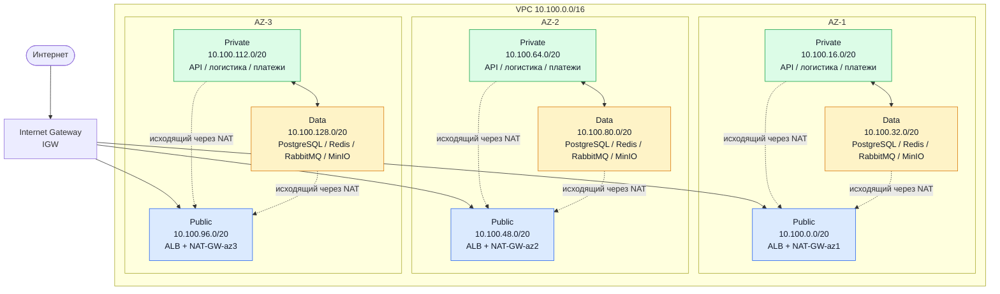

# Лаба 1 — Проектирование сетевой архитектуры облака (VPC, балансировщики, связность)

# 1. Исходные данные (условие задачи)

**Название сервиса:** Пальчики оближешь

**Тип сервиса:** интернет-магазин по доставке фруктов и ягод

**Целевая аудитория:** жители Ленинградской области

**Основные пользовательские сценарии:** просмотр каталога, оформление заказа

**Состав сервисов:**

| Сервис | Назначение | Особенности |
| --- | --- | --- |
| веб-фронтенд |	публичная часть сервиса, интерфейсы для покупателей, менеджеров и курьеров |	HTTP/HTTPS, кэширование статики |
| API-бэкенд |	бизнес-логика: каталог, корзина, заказы, оплата, управление пользователями |	REST API, /api/catalog, /api/cart, /api/orders, /api/users, /api/payments |
| база данных |	хранение товаров, заказов, поставщиков, пользователей |резервное копирование |
| кэш | кэширование каталога, сессий пользователей | высокая скорость |
| брокер сообщений | асинхронная обработка заказов | надёжное хранение событий |
| платёжный шлюз | онлайн-оплата | хранение логов транзакций, обработка webhook-ов, исходящие HTTPS-запросы к внешнему API|
| сервис логистики | определение времени доставки, назначение курьеров, трекинг | геоданные, расчёт маршрутов, push-уведомления |

**Требования к отказоустойчивости:**

- Работа в трёх зонах доступности (AZ);
- Балансировщик: веб-фронтенд и API должны отдаваться через балансировщик нагрузки;
- Только веб-фронтенд находится в публичной подсети;
- Выход в интернет у всех подсетей; у приватных — только исходящий;
- Каждый элемент должен иметь резерв, не должно быть Single Point of Failure.


# 2. Задание и ход выполнения
## 1. Обоснование CIDR
Для CIDR выбран диапазон **`10.100.0.0/16`**.

Диапазон `/16` содержит 65 536 IPv4-адресов и оставляет достаточный запас для размещения подсетей в трёх зонах доступности: 9 подсетей (public / private / data × 3 AZ) занимают лишь часть диапазона, остаётся место под новые сервисы, dev/stage-стенды и будущие AZ.

Выбранный диапазон не пересекается с сетями, уже зафиксированными в инфраструктуре компании (прописаны выдуманные сети):

| Сеть | CIDR | Пересечение с VPC |
| --- | --- | --- |
| On-premise ДЦ (СПб) | `192.168.0.0/16` | Нет |
| Офисная сеть | `172.16.0.0/16` | Нет |
| WireGuard VPN | `10.8.0.0/24` | Нет |
| Docker/dev-стенды | `10.200.0.0/16` | Нет |

Диапазон `10.100.0.0/16` свободен и оставляет запас `10.101.0.0/16 … 10.255.0.0/16` под будущие VPC.

---

## 2. Таблица подсетей
Внутри каждой таблицы маршрутизации действует служебная запись `10.100.0.0/16 → local`, которая обеспечивает связь между подсетями одной VPC.

| Зона | Подсеть | CIDR | Тип | Маршрут по умолчанию |
| --- | --- | --- | --- | --- |
| `AZ-1` | публичная | `10.100.0.0/20` | public | IGW |
| `AZ-1` | приватная | `10.100.16.0/20` | private | NAT-GW-az1 |
| `AZ-1` | data | `10.100.32.0/20` | data | NAT-GW-az1 / VPC Endpoint |
| `AZ-2` | публичная | `10.100.48.0/20` | public | IGW |
| `AZ-2` | приватная | `10.100.64.0/20` | private | NAT-GW-az2 |
| `AZ-2` | data | `10.100.80.0/20` | data | NAT-GW-az2 / VPC Endpoint |
| `AZ-3` | публичная | `10.100.96.0/20` | public | IGW |
| `AZ-3` | приватная | `10.100.112.0/20` | private | NAT-GW-az3 |
| `AZ-3` | data | `10.100.128.0/20` | data | NAT-GW-az3 / VPC Endpoint |

Как устроены подсети по типам:

- **Публичные** — здесь живут только балансировщик и NAT Gateway. Никакой бизнес-логики и тем более баз данных тут нет.
- **Приватные** — API-бэкенд, платёжный шлюз, сервис логистики. Входящие запросы приходят исключительно от ALB (по правилам Security Group), наружу — только через NAT своей зоны.
- **Data** — PostgreSQL, Redis, RabbitMQ, MinIO. Из интернета сюда попасть нельзя вообще. Для доступа к S3-совместимым бэкапам и Secrets Manager используются VPC Endpoints, а NAT остаётся резервным путём для обновлений.

Отдельный NAT Gateway в каждой зоне нужен для того, чтобы отказ одной AZ не отрезал от интернета остальные две. Если бы NAT был один, его падение положило бы исходящий трафик во всём сервисе.

---

## 3. Схема сети


**Что видно на схеме:**

- Один **IGW** на всю VPC — точка входа для публичных подсетей.
- Три **NAT Gateway** — по одному в каждой AZ (резервирование).
- **VPC Endpoints** для data-подсетей (S3, Secrets Manager, ECR).
- Потоки: интернет → IGW → ALB → private (API) → data (БД, кэш, очередь).

---


## 4. Балансировщики

## 5. Связность и резервирование

## 5.1. Internet Gateway (IGW)

К VPC подключён один Internet Gateway. В маршрутных таблицах всех трёх публичных подсетей прописано:

```
10.100.0.0/16 → local
0.0.0.0/0     → IGW
```

Публичные подсети принимают входящий HTTPS-трафик только на балансировщик. Backend-сервисы и БД в публичных подсетях не размещаются.

## 5.2. NAT Gateway

Приватные и data-подсети используют NAT Gateway своей зоны доступности:

| Подсеть | Маршрут по умолчанию |
| --- | --- |
| `rt-private-az1`, `rt-data-az1` | `0.0.0.0/0 → NAT-GW-az1` |
| `rt-private-az2`, `rt-data-az2` | `0.0.0.0/0 → NAT-GW-az2` |
| `rt-private-az3`, `rt-data-az3` | `0.0.0.0/0 → NAT-GW-az3` |

Это исключает зависимость исходящего доступа всех трёх зон от одного зонального шлюза. При отказе одной AZ ресурсы двух оставшихся зон сохраняют собственные маршруты в интернет. При использовании единственного NAT Gateway отказ зоны его размещения лишил бы исходящего интернет-доступа ресурсы во всех зависимых от него подсетях.

**Аварийное переключение** на шлюз соседней зоны (если NAT своей AZ недоступен):

```
Штатный режим:    0.0.0.0/0 → NAT-GW-az1
При отказе AZ-1:  0.0.0.0/0 → NAT-GW-az2
```

В обычном режиме каждая AZ по-прежнему использует собственный NAT.

## 5.3. Резервирование каналов с on-premise

| Основной путь | Резервный путь |
| --- | --- |
| Direct Connect через маршрутизатор R1 | Site-to-Site VPN через другой маршрутизатор R2 и независимый интернет-канал |

Переключение делается через BGP: пока Direct Connect жив, весь трафик идёт по нему; как только маршрут перестаёт анонсироваться, трафик автоматически уходит через VPN. Это значит, что даже при обрыве выделенного канала сервисы на стороне офиса (складская система, бухгалтерия) продолжат работать без ручного вмешательства.

---

## 6. Безопасность

## 7. Выводы 