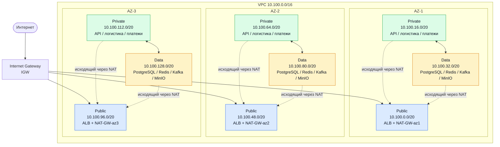

# Лаба 3 — Проектирование сетевой архитектуры облака (VPC, балансировщики, связность)

## 1. Цель работы

Закрепить на практике знания по сетевой архитектуре облака: спроектировать VPC с тремя зонами доступности, выбрать и настроить балансировщик, обеспечить связность с интернетом и on-premise, применить чек-лист проектирования и задокументировать результат.

## 2. Исходные данные

**Название сервиса:** Пальчики оближешь
**Тип сервиса:** интернет-магазин по доставке фруктов и ягод
**Целевая аудитория:** жители Ленинградской области
**Основные пользовательские сценарии:** просмотр каталога, оформление заказа

**Состав сервисов:**

| Сервис | Назначение | Особенности |
| --- | --- | --- |
| веб-фронтенд | публичная часть сервиса, интерфейсы для покупателей, менеджеров и курьеров | HTTP/HTTPS, кэширование статики |
| API-бэкенд | бизнес-логика: каталог, корзина, заказы, оплата, управление пользователями | REST API, `/api/*`, `/orders/*` |
| база данных | хранение товаров, заказов, поставщиков, пользователей | резервное копирование, master-replica |
| кэш | кеширование каталога, сессий пользователей | высокая скорость |
| брокер сообщений | асинхронная обработка заказов | надёжное хранение событий |
| платёжный шлюз | онлайн-оплата | логи транзакций, webhook-и, исходящие HTTPS |
| сервис логистики | определение времени доставки, назначение курьеров, трекинг | геоданные, расчёт маршрутов, push |
| MinIO | S3-совместимое объектное хранилище | изображения товаров, бэкапы, порт 9000 |

**Требования к отказоустойчивости:**
- Работа в трёх зонах доступности (AZ).
- Балансировщик: веб-фронтенд и API отдаются через балансировщик нагрузки.
- Только веб-фронтенд находится в публичной подсети.
- Выход в интернет у всех подсетей; у приватных — только исходящий.
- Каждый элемент имеет резерв, нет Single Point of Failure.

## 3. Задание и ход выполнения

### Этап 1. Проектирование VPC

#### 3.1. Обоснование CIDR

Для CIDR выбран диапазон **`10.100.0.0/16`**.

Диапазон `/16` содержит 65 536 IPv4-адресов и оставляет достаточный запас для размещения подсетей в трёх зонах доступности: 9 подсетей (public / private / data × 3 AZ) занимают лишь часть диапазона, остаётся место под новые сервисы, dev/stage-стенды и будущие AZ.

Выбранный диапазон не пересекается с сетями, зафиксированными в инфраструктуре компании:

| Сеть | CIDR | Пересечение с VPC |
| --- | --- | --- |
| On-premise ДЦ (СПб) | `192.168.0.0/16` | Нет |
| Офисная сеть | `172.16.0.0/16` | Нет |
| WireGuard VPN | `10.8.0.0/24` | Нет |
| Docker/dev-стенды | `10.200.0.0/16` | Нет |

Диапазон `10.100.0.0/16` свободен и оставляет запас `10.101.0.0/16 … 10.255.0.0/16` под будущие VPC.

#### 3.2. Таблица подсетей

| Зона | Подсеть | CIDR | Тип | Маршрут по умолчанию |
| --- | --- | --- | --- | --- |
| AZ-1 | публичная | `10.100.0.0/20` | public | IGW |
| AZ-1 | приватная | `10.100.16.0/20` | private | NAT-GW-az1 |
| AZ-1 | data | `10.100.32.0/20` | data | NAT-GW-az1 / VPC Endpoint |
| AZ-2 | публичная | `10.100.48.0/20` | public | IGW |
| AZ-2 | приватная | `10.100.64.0/20` | private | NAT-GW-az2 |
| AZ-2 | data | `10.100.80.0/20` | data | NAT-GW-az2 / VPC Endpoint |
| AZ-3 | публичная | `10.100.96.0/20` | public | IGW |
| AZ-3 | приватная | `10.100.112.0/20` | private | NAT-GW-az3 |
| AZ-3 | data | `10.100.128.0/20` | data | NAT-GW-az3 / VPC Endpoint |

Внутри каждой таблицы маршрутизации действует служебная запись `10.100.0.0/16 → local` для связи между подсетями одной VPC.

**Устройство подсетей по типам:**
- **Публичные** — только балансировщик и NAT Gateway.
- **Приватные** — API-бэкенд, платёжный шлюз, сервис логистики. Входящие запросы — только от ALB. Наружу — через NAT своей зоны.
- **Data** — PostgreSQL, Redis, Kafka, MinIO. Из интернета доступа нет. VPC Endpoints для внешних сервисов (S3, Secrets Manager, ECR), NAT — резервный путь.

Отдельный NAT Gateway в каждой зоне нужен, чтобы отказ одной AZ не отрезал от интернета остальные две.

#### 3.3. Схема сети



**Что видно на схеме:**
- Один **IGW** на всю VPC — точка входа для публичных подсетей.
- Три **NAT Gateway** — по одному в каждой AZ.
- **VPC Endpoints** для data-подсетей.
- Поток: интернет → IGW → ALB → private (API) → data (БД, кэш, очередь).

**Контрольная точка 1 пройдена:** БД в data-подсети, не в публичной; у каждого компонента есть резерв.

### Этап 2. Балансировщики нагрузки

| Сервис | Тип балансировщика | Уровень | Правило / стратегия |
| --- | --- | --- | --- |
| Веб-фронтенд + API (публичный трафик) | ALB | L7 | `/api/*`, `/orders/*` → `tg-api-backend`; `/*` → `tg-frontend`. Стратегия — Round Robin. Health check: HTTP `GET /health` (API), `GET /` (фронтенд). |
| PostgreSQL (репликация read-реплик) | NLB (не настраивается) | L4 | TCP-балансировка на порт 5432 между read-репликами. В текущей архитектуре не используется — мастер-репликация настраивается на уровне СУБД. |
| Внутренние сервисы (Kafka, Redis) | — | — | Балансировка не требуется, кластеры сами распределяют нагрузку. |

**Обоснование выбора L7 (ALB):**
- Нужна маршрутизация по HTTP-путям (`/api/*`, `/orders/*` → API, остальное → фронтенд) — это умеет только L7.
- Health check на уровне HTTP-ответа (`200 OK`) надёжнее, чем проверка открытого TCP-порта.
- Единая точка входа для пользователей (один домен, порт 443).
- SSL-терминация на балансировщике.

**Health checks и стратегия:**

| Параметр | Значение |
| --- | --- |
| Тип проверки | HTTP |
| Эндпоинт API | `GET /health` → 200 OK |
| Эндпоинт фронтенда | `GET /` → 200 OK |
| Интервал | 30 секунд |
| Порог отказа | 2 неудачные проверки |
| Порог восстановления | 2 успешные проверки |
| Стратегия | Round Robin |

**Резервирование:** ALB — управляемый сервис, резервируется на уровне провайдера. Целевые группы содержат минимум 2 инстанса в разных AZ.

**Балансировщик для БД:** для PostgreSQL-репликации отдельный балансировщик не требуется — мастер-репликация настраивается на уровне СУБД. При необходимости балансировки read-реплик использовался бы **NLB (L4)**, так как требуется высокая скорость без анализа HTTP.

**Контрольная точка 2 пройдена:** API-запросы не попадают на статику, фронтенд не обрабатывает API.

### Этап 3. Связность с внешним миром

#### 3.4. Internet Gateway (IGW)

К VPC подключён один IGW. В маршрутных таблицах всех трёх публичных подсетей:

```
10.100.0.0/16 → local
0.0.0.0/0     → IGW
```

Публичные подсети принимают входящий HTTPS-трафик только на балансировщик. Backend и БД в публичных подсетях не размещаются.

#### 3.5. NAT Gateway

Приватные и data-подсети используют NAT Gateway своей зоны:

| Подсеть | Маршрут по умолчанию |
| --- | --- |
| `rt-private-az1`, `rt-data-az1` | `0.0.0.0/0 → NAT-GW-az1` |
| `rt-private-az2`, `rt-data-az2` | `0.0.0.0/0 → NAT-GW-az2` |
| `rt-private-az3`, `rt-data-az3` | `0.0.0.0/0 → NAT-GW-az3` |

**Почему по одному NAT в каждой AZ:** это исключает SPOF на уровне исходящего доступа. При отказе одной AZ ресурсы двух оставшихся зон сохраняют собственные маршруты в интернет.

**Аварийное переключение** (если NAT своей AZ недоступен):

```
Штатный режим:    0.0.0.0/0 → NAT-GW-az1
При отказе AZ-1:  0.0.0.0/0 → NAT-GW-az2
```

#### 3.6. Резервирование каналов с on-premise

| Основной путь | Резервный путь |
| --- | --- |
| Direct Connect через маршрутизатор R1 | Site-to-Site VPN через маршрутизатор R2 и независимый интернет-канал |

Переключение — через BGP: пока Direct Connect жив, весь трафик идёт по нему; при потере анонса маршрут автоматически уходит через VPN. Это значит, что даже при обрыве выделенного канала сервисы на стороне офиса (складская система, бухгалтерия) продолжат работать без ручного вмешательства.

### Этап 4. Безопасность и журналирование

#### 3.7. Принципы построения Security Groups

1. **Stateful** — ответный трафик на разрешённое входящее соединение уходит автоматически.
2. **Принцип минимальных привилегий** — каждому сервису открыт только тот порт, который нужен, и только от нужного источника.
3. **Ссылки на SG вместо CIDR** — при смене IP-адресов правила не придётся переписывать.

#### 3.8. SG для веб-фронтенда

| Направление | Протокол | Порт | Источник / Назначение | Назначение правила |
| --- | --- | --- | --- | --- |
| Входящее | TCP | 80 | SG ALB | Приём трафика только от балансировщика |
| Исходящее | TCP | 443 | `0.0.0.0/0` | Обновления пакетов, CDN, внешние API (через NAT) |

#### 3.9. SG для API-бэкенда

| Направление | Протокол | Порт | Источник / Назначение | Назначение правила |
| --- | --- | --- | --- | --- |
| Входящее | TCP | 3000 | SG ALB | Приём API-запросов только от балансировщика |
| Исходящее | TCP | 9000 | SG MinIO | Чтение и запись изображений товаров |
| Исходящее | TCP | 5432 | SG базы данных | Подключение к PostgreSQL |
| Исходящее | TCP | 6379 | SG кэша | Подключение к Redis |
| Исходящее | TCP | 9092 | SG Kafka | Отправка событий заказов |
| Исходящее | TCP | 3001 | SG сервиса логистики | Вызовы сервиса логистики |
| Исходящее | TCP | 443 | `0.0.0.0/0` | Обращение к внешним API через NAT |

#### 3.10. SG для базы данных (PostgreSQL)

| Направление | Протокол | Порт | Источник / Назначение | Назначение правила |
| --- | --- | --- | --- | --- |
| Входящее | TCP | 5432 | SG API-бэкенда | Подключение от API |
| Входящее | TCP | 5432 | SG сервиса логистики | Подключение от логистики |
| Входящее | TCP | 5432 | SG платёжного сервиса | Подключение от платежей |
| Исходящее | TCP | 9000 | SG MinIO | Отправка бэкапов в MinIO |
| Исходящее | TCP | 443 | `0.0.0.0/0` | Обновления, отправка бэкапов через VPC Endpoint |

**Контрольная точка 3 пройдена:** БД открыта только для трёх конкретных Security Groups (API, логистика, платежи). Из интернета в БД попасть нельзя.

#### 3.11. SG для NAT Gateway

NAT Gateway — управляемый сервис, у него нет своего Security Group в привычном смысле. Входящий трафик — только из приватных и data-подсетей VPC. Исходящий — в интернет через Elastic IP. Из интернета входящие соединения невозможны: NAT работает только в одну сторону.

#### 3.12. VPC Flow Logs

VPC Flow Logs фиксируют метаданные о каждом IP-пакете: IP источника/назначения, порты, протокол, количество байт, действие (ACCEPT/REJECT), временную метку. Содержимое пакетов **не сохраняется** — только метаданные.

**Куда пишутся логи:** CloudWatch Logs (1–3 месяца) + S3 (долговременное хранение 1 год).

**Зачем нужны и что позволяют обнаружить:**
- **Попытки несанкционированного доступа** — записи REJECT с внешних IP на порт 5432.
- **Аномалии трафика** — рост исходящего трафика из API может означать утечку данных.
- **Проблемы с маршрутизацией** — куда уходит трафик и возвращается ли ответ.
- **Аудит соответствия** — доказательство защищённости каналов для платёжного сервиса.
- **Диагностика** — доходит ли запрос до БД и что та отвечает.

**Что включаем:** Flow Logs для всей VPC (или отдельных подсетей), фильтр — весь трафик (ALL).

## 4. Отчёт

### 4.1. Обоснование CIDR

Выбран диапазон `10.100.0.0/16`. Маска `/16` — стандарт для VPC: даёт 65 536 адресов, покрывает 9 подсетей в трёх AZ с большим запасом. Не пересекается с on-premise (`192.168.0.0/16`), офисной сетью (`172.16.0.0/16`), VPN (`10.8.0.0/24`) и dev-стендами (`10.200.0.0/16`).

### 4.2. Таблица подсетей

См. раздел 3.2.

### 4.3. Схема сети

См. раздел 3.3.

### 4.4. Балансировщики

| Сервис | Тип | Уровень | Правило / стратегия |
| --- | --- | --- | --- |
| Веб-фронтенд + API | ALB | L7 | `/api/*`, `/orders/*` → API; `/*` → фронтенд. Round Robin. HTTP health check. |
| PostgreSQL (read-реплики) | NLB (не настроен) | L4 | TCP 5432, в текущей архитектуре не используется |

### 4.5. Связность и резервирование

- **IGW** — один на VPC, подключён к публичным подсетям.
- **NAT Gateway** — по одному в каждой AZ, исключает SPOF.
- **Резервирование каналов с on-premise** — Direct Connect (основной) + Site-to-Site VPN (резервный), переключение по BGP.

### 4.6. Выводы

В ходе работы:
- Спроектирована VPC `10.100.0.0/16` с запасом под будущие сервисы и стенды.
- Нарезаны 9 подсетей — по три типа в каждой из трёх AZ. Публичные — только ALB и NAT; бизнес-логика и данные изолированы.
- Настроена маршрутизация: IGW для публичных, отдельный NAT в каждой AZ для приватных и data.
- Выбран ALB (L7) как единая точка входа с маршрутизацией по путям и стратегией Round Robin.
- Обеспечено резервирование каналов с on-premise через Direct Connect + VPN.
- Настроены Security Groups по принципу минимальных привилегий: БД закрыта для интернета, доступ только от API, логистики и платежей.
- Включены VPC Flow Logs для аудита и обнаружения аномалий.

**Что запомнили и какие ошибки избежали:**
- Не разместили БД в публичной подсети — это классическая ошибка, которая открывает базу для сканирования и атак.
- Не использовали один NAT Gateway на все AZ — иначе его падение положило бы исходящий трафик всего сервиса.
- Не открывали Security Groups на `0.0.0.0/0` без необходимости — используем ссылки на SG вместо CIDR.
- Разделили подсети по назначению (public / private / data) — это упрощает управление правилами безопасности.

## 5. Чек-лист самопроверки

- ☑️ CIDR-блок: маска `/16` или меньше, без пересечений с существующими сетями.
- ☑️ Подсети: по одной в каждой из трёх зон доступности (публичная + приватная + data).
- ☑️ Маршрутизация: публичные → IGW, приватные → NAT/Endpoints.
- ☑️ Балансировщик выбран корректно по уровню (L4/L7) — обосновано в отчёте.
- ☑️ Health checks настроены для всех групп серверов.
- ☑️ NAT Gateway — в каждой зоне доступности (нет SPOF).
- ☑️ БД не в публичной подсети, доступна только API-бэкенду (и связанным сервисам).
- ☑️ VPC Flow Logs включены.
- ☑️ Резервирование каналов описано (Direct Connect + Site-to-Site VPN).
- ☑️ Схема сети и документация маршрутов приложены.
- ☑️ Ресурсы реальной облачной среды не создавались (проектирование без развёртывания).

## 6. Контрольные вопросы

### Чем VXLAN отличается от VLAN? Какие ограничения VLAN решает VXLAN?

**VLAN** работает на L2 и использует 12-битный идентификатор (до 4094 сегментов). Привязан к физической топологии, не растягивается через L3-границы.

**VXLAN** — overlay-технология: инкапсулирует L2-кадры в UDP, работает поверх L3. Использует 24-битный идентификатор (до 16 млн сегментов).

**Что решает VXLAN:**
- Масштаб (4094 → 16 млн).
- Географическая распределённость — L2-сеть между разными ЦОД и зонами.
- Миграция ВМ между подсетями и дата-центрами без смены IP.

### ALB или NLB для gRPC и WebSocket?

**Для обоих — NLB (L4).** gRPC и WebSocket используют долгоживущие TCP-соединения; L7-балансировщик может нежелательно прерывать их HTTP-таймаутами. NLB просто проксирует TCP-поток, не анализируя содержимое.

### Что будет с CDN, если не выставить Cache-Control? Почему важен TTL для API?

Без `Cache-Control` CDN применит TTL по умолчанию (например, 7 дней) — обновления на источнике не будут видны пользователям. Для API это критично: возвращает динамические данные (цены, остатки, статусы заказов). Правильный TTL — секунды или `no-store` для чувствительных данных.

### Сколько NAT Gateway нужно в production на 3 AZ и почему?

**Три — по одному на AZ.** Обеспечивают отказоустойчивость (падение одной AZ не отрезает остальные) и экономят на cross-AZ трафике (NAT своей зоны обслуживает свои подсети).

### Чем Security Group отличается от Network ACL?

**Security Group** — stateful, уровень инстанса, только allow. Ответный трафик разрешается автоматически.

**Network ACL** — stateless, уровень подсети, есть allow и deny. Ответный трафик нужно разрешать отдельным правилом.

### Почему нельзя держать базу данных в публичной подсети?

Публичный IP или открытый SG делают БД доступной для сканирования и атак. Правильно — data-подсеть, доступ только от API через SG.

### Зачем нужны VPC Flow Logs?

Фиксируют метаданные трафика для аудита и обнаружения: попыток несанкционированного доступа, аномалий, проблем маршрутизации, нарушений соответствия.
