# Lab 4 - Kafka для двух сервисов

Постановка и настройка Kafka с нуля для двух сервисов: издателя заказов (`user-service`) и обработчика (`picker-service`).

## Что это

Продолжение Лабы 1: в архитектуре "Пальчики оближешь" есть действие - сборка заказа. Оформленный заказ надо укомплектовать, назначить курьера, доставить. Эти шаги развязываются через брокер сообщений - Kafka.

Между двумя сервисами поставлена Kafka: `user-service` публикует событие "заказ создан", `picker-service` читает его и "собирает" заказ.

## Что поднято

| Компонент | Роль | Порт |
|-----------|------|------|
| `kafka` | Брокер в KRaft-режиме (без ZooKeeper) | 9092 |
| `kafka-init` | Init-контейнер: создаёт топик `orders` из конфигурации | - |
| `user-service` | Издатель заказов (Producer) | 8001 |
| `picker-service` | Обработчик заказов (Consumer) | 8002 |
| `kafka-ui` | Веб-интерфейс для просмотра топиков и групп | 8080 |
| `kafka-exporter` | Экспортёр метрик Kafka для Prometheus | 9308 |
| `prometheus` | Сбор метрик | 9090 |
| `grafana` | Визуализация | 3000 |
| `alertmanager` | Рассылка алертов | 9093 |
| `loki` + `promtail` | Сбор логов | 3100 |
| `node-exporter` | Метрики хоста | 9100 |

Всё развёрнуто через Docker Compose на домашнем сервере. Сервисы общаются через общую Docker-сеть `monitoring-net`.


## Что делает каждый сервис

### user-service (Producer)

- HTTP-страница `http://localhost:8001/` с кнопкой "Создать заказ".
- На нажатие - публикует событие "заказ создан" в топик `orders`.
- Показывает, что отправил: `order_id`, `partition`, `offset`.

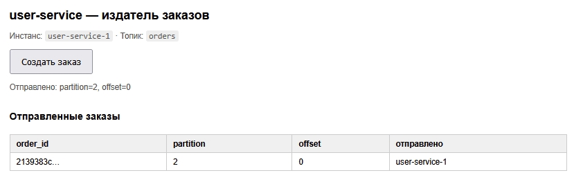

### picker-service (Consumer)

- Читает топик `orders` в группе `picker-group`.
- Обрабатывает каждое сообщение (имитация "сборки" - пауза 1.5 секунды).
- Логирует и отображает: `order_id`, `partition`, `offset`, имя инстанса.

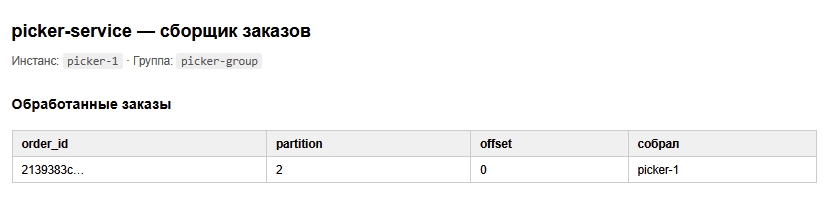

### Конфигурация через env

| Переменная | Что задаёт | Значение |
|-----------|-----------|----------|
| `KAFKA_BOOTSTRAP_SERVERS` | Адрес брокера | `kafka:9092` |
| `KAFKA_TOPIC` | Имя топика | `orders` |
| `KAFKA_GROUP_ID` | Consumer group (только picker) | `picker-group` |

## Как всё поднято через конфигурацию

### Kafka в KRaft-режиме

Kafka запускается без ZooKeeper - в режиме KRaft. Метаданные кластера хранит сама Kafka. Для учебного проекта один узел выполняет обе роли: `broker` (хранит данные) и `controller` (управляет кластером).

Ключевые параметры в `docker-compose.yml` → `kafka` → `environment`:

```yaml
KAFKA_NODE_ID: 1
KAFKA_PROCESS_ROLES: broker,controller
KAFKA_CONTROLLER_QUORUM_VOTERS: 1@kafka:9093
KAFKA_LISTENERS: PLAINTEXT://:9092,CONTROLLER://:9093
KAFKA_ADVERTISED_LISTENERS: PLAINTEXT://kafka:9092
KAFKA_AUTO_CREATE_TOPICS_ENABLE: "false"
KAFKA_NUM_PARTITIONS: 3
KAFKA_DEFAULT_REPLICATION_FACTOR: 1
```

### Декларация топика

Топик создаётся не через CLI, а через init-контейнер `kafka-init` при старте `docker compose up`. Все параметры заданы в конфигурации:

```yaml
kafka-init:
  image: apache/kafka:4.1.1
  depends_on:
    kafka:
      condition: service_healthy
  environment:
    - ORDERS_PARTITIONS=3
    - ORDERS_RETENTION_MS=604800000    # 7 дней
  entrypoint: ["/bin/sh", "-c"]
  command:
    - |
      /opt/kafka/bin/kafka-topics.sh --bootstrap-server kafka:9092 \
        --create --if-not-exists \
        --topic orders \
        --partitions $${ORDERS_PARTITIONS} \
        --replication-factor 1 \
        --config retention.ms=$${ORDERS_RETENTION_MS} && \
      echo 'Topic orders is ready'
```

Как это работает:

1. `kafka` стартует и проходит healthcheck.
2. `kafka-init` подключается и создаёт топик `orders` с параметрами из env.
3. `kafka-init` завершается (`restart: "no"`).
4. `user-service` и `picker-service` ждут завершения init-контейнера (`condition: service_completed_successfully`) и только потом стартуют.

Итог: любой параметр топика (партиции, retention, replication factor) задаётся в конфиге. Изменение - правка `docker-compose.yml` → `docker compose up -d kafka-init`.

Исключение: `--create --if-not-exists` не пересоздаёт существующий топик, поэтому некоторые параметры (например, `partitions`) можно только увеличить, но не уменьшить. Для уменьшения нужно удалить и создать топик заново.

## Часть 3. Бизнес-ситуации через конфигурацию

### 1. Подготовка к распродаже

Проблема: скоро распродажа, ожидается всплеск заказов. Один picker не справится - нужно, чтобы несколько picker'ов обрабатывали заказы параллельно.

Что решает: увеличение числа партиций топика `orders`. Больше партиций → можно запустить больше consumer'ов в одной группе → выше параллелизм.

Что сделали: в `docker-compose.yml` изменили `ORDERS_PARTITIONS` с 3 на 6, применили `docker compose up -d kafka-init`.

Что наблюдали: в Kafka UI → Topics → orders - 6 партиций вместо 3. Теперь до 6 picker'ов могут работать параллельно.

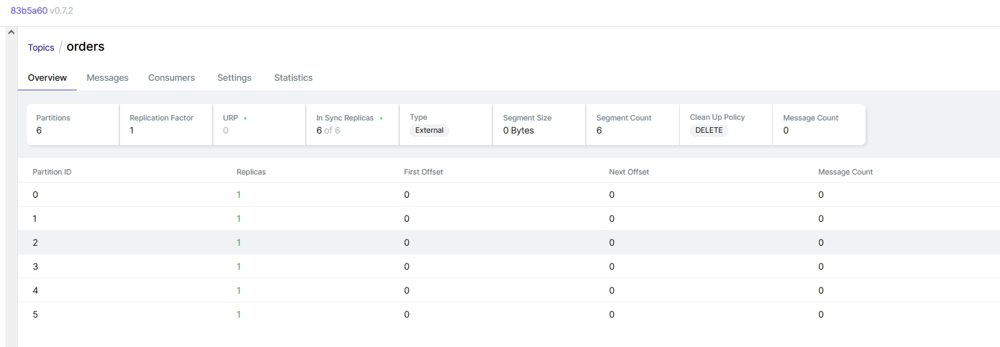

Про возврат к меньшему числу партиций: Kafka не поддерживает уменьшение числа партиций. Партиции - единица параллелизма и хранения: каждая партиция физически лежит на брокере, её offset'ы и сегменты нельзя "объединить" с другой. Единственный способ уменьшить - удалить топик и создать заново.

### 2. Добавляем второй picker

Проблема: нужно, чтобы обработку тянули несколько picker'ов параллельно.

Что решает: запуск второго экземпляра `picker-service` в той же consumer group (`picker-group`). Kafka автоматически распределит партиции между членами группы.

Что сделали:

- Убрали `container_name: picker-service` из `docker-compose.yml` - иначе `--scale` не работает.
- Убрали `ports` - иначе второй контейнер не запустится (порт занят).
- Запустили: `docker compose up -d --scale picker-service=2`.

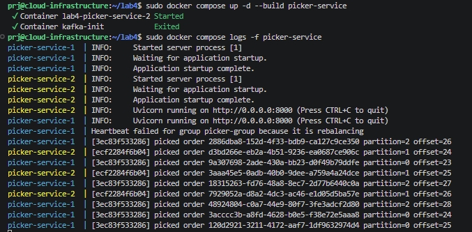

Что наблюдали:

- Заказы распределились между двумя инстансами. Каждый заказ обработан ровно один раз, ровно одним picker'ом.

Что если picker'ов больше, чем партиций: Kafka не даст четвёртому consumer'у партицию. Он подключится к группе, но будет простаивать.

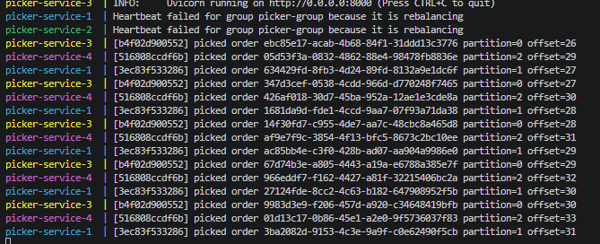

### 3. Picker упал во время деплоя

Проблема: во время деплоя `picker-service` перезапускается, а `user-service` продолжает создавать заказы. Не потеряются ли эти заказы?

Что решает: Kafka хранит сообщения независимо от того, прочитал их consumer или нет. Consumer group помнит свой offset - "закладку" в каждой партиции. При возврате consumer продолжает читать с того же места.

Что делали:

1. Остановили picker: `docker compose stop picker-service`.
2. Создали 5 заказов через `user-service`.
3. Проверили в Kafka UI:
   - Topics → orders → Messages - все 5 заказов лежат в топике.
   - Consumers → picker-group - Active members = 0, Total lag > 0.
4. Запустили picker обратно: `docker compose start picker-service`.
5. В логах увидели: picker прочитал все пропущенные заказы.

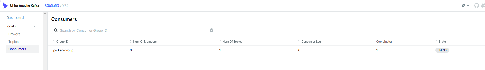

Почему это работает:

В классической очереди сообщение удаляется после чтения. Если consumer упал - сообщение либо осталось в очереди (и может быть потеряно при рестарте брокера), либо уже удалено.

В Kafka другая модель:

- Сообщение хранится в топике фиксированное время (`retention.ms`, у нас 7 дней). Оно не удаляется после чтения.
- Consumer сдвигает offset группы - "закладку", докуда дошёл. При остановке consumer'а offset не сбрасывается.
- Когда consumer возвращается - читает с той же позиции и обрабатывает всё, что пропустил.


## Часть 4. Подними Kafka UI

В docker-compose.yml:

```
kafka-ui:
    image: provectuslabs/kafka-ui:latest
    container_name: kafka-ui
    ports:
      - "8080:8080"
    environment:
      - KAFKA_CLUSTERS_0_NAME=local
      - KAFKA_CLUSTERS_0_BOOTSTRAPSERVERS=kafka:9092
    networks:
      - monitoring-net
    depends_on:
      - kafka
    restart: unless-stopped
```

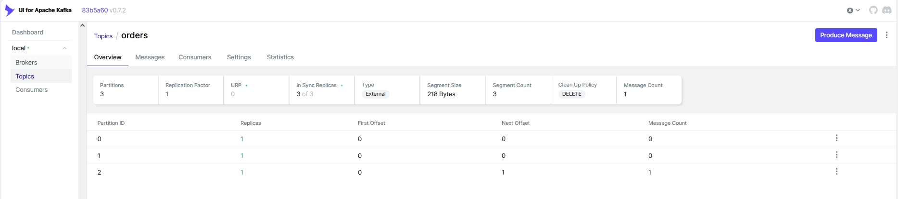

## Часть 5. Бизнес-ситуации через Kafka UI

### 1. Разбор жалобы на конкретный заказ

Проблема: клиент жалуется, что заказ X не собран. Нужно найти сообщение в Kafka и понять, обработано ли оно.

Что делали:

1. Создали 5-6 заказов через user-service, запомнили `order_id` одного из них.
2. Открыли Kafka UI → Topics → orders → Messages.
3. В поиске по value ввели `order_id`.
4. Нашли сообщение, определили partition и offset.
5. Открыли Consumers → picker-group → Offsets. Проверили `Current offset` группы по найденной партиции.

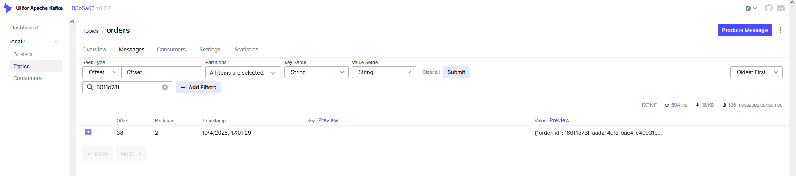

Что наблюдали: если `Current offset` группы >= offset сообщения + 1, заказ уже прочитан. Если меньше - ждёт обработки.

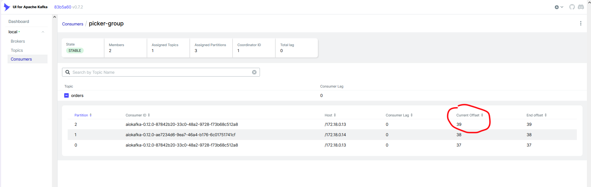

Почему это полезно: Kafka даёт точечный поиск по сообщению и его состоянию (прочитано / не прочитано). В классической очереди это невозможно - после чтения сообщение исчезает.


### 2. Пересчёт истории для аналитики

Проблема: аналитикам нужно заново прогнать все заказы с самого начала - например, чтобы пересчитать статистику.

Что делали:

1. Убедились, что в топике есть несколько заказов.
2. Открыли Kafka UI → Consumers → picker-group.
3. Остановили picker (`docker compose stop picker-service`) - сбросить offset'ы можно только у неактивной группы (`Group's offsets can be reset only if group is inactive`).
4. В Kafka UI сбросили offset'ы группы на `earliest` (Reset offsets → earliest).
5. Запустили picker обратно.
6. В логах увидели: picker заново читает все сообщения с самого начала.

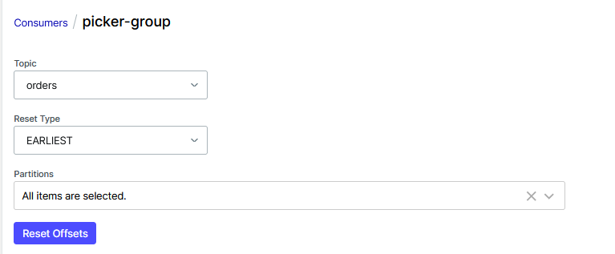

Почему так можно в Kafka: сообщения не удаляются после чтения, а хранятся в топике до истечения `retention.ms`. Consumer лишь сдвигает закладку (offset). Сбросив закладку в начало, можно перечитать всю историю.

Почему так нельзя в обычной очереди: в классической очереди сообщение удаляется после чтения (ack). Перечитать историю невозможно - данных просто нет.

### 3. Диск заполняется старыми заказами (retention)

Проблема: заказы нужны только пару дней, но копятся бесконечно, занимая место.

Что делали:

1. Уменьшили `retention.ms` до 60 секунд через Kafka UI (Topics → orders → Edit settings).
2. Создали новые заказы.
3. Подождали 2-3 минуты.

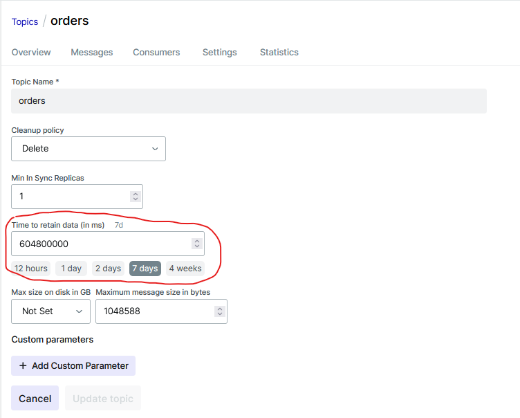

Что наблюдали: через несколько минут старые сообщения удалились из Kafka UI - даже те, что уже были прочитаны picker'ом.

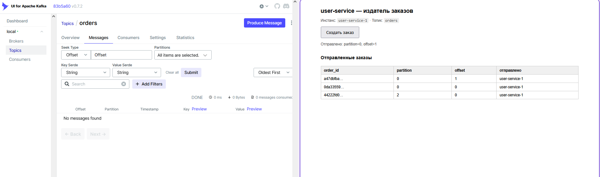

## Часть 6. Мониторинг

Для сбора метрик Kafka используется kafka-exporter - отдельный сервис, который опрашивает брокера и отдаёт метрики в формате Prometheus на `:9308`.

Prometheus скрейпит `kafka-exporter` каждые 15 секунд. Grafana показывает метрики на дашборде. Alertmanager получает сработавшие алерты.

### Дашборд

Дашборд `Kafka - Lab 4` включает 4 панели:

| Панель | Запрос | Что показывает |
|--------|--------|----------------|
| Messages per partition | `kafka_topic_partition_current_offset{topic="orders"}` | Сколько всего сообщений в каждой партиции. Растёт по мере создания заказов. |
| Consumer lag | `kafka_consumergroup_lag{consumergroup="picker-group"}` | Отставание группы по партициям. Если 0 - всё прочитано. Растёт, когда picker отстаёт или остановлен. |
| Active consumers | `kafka_consumergroup_members{consumergroup="picker-group"}` | Сколько consumer'ов сейчас в группе. Реагирует на `--scale picker-service=N`. |

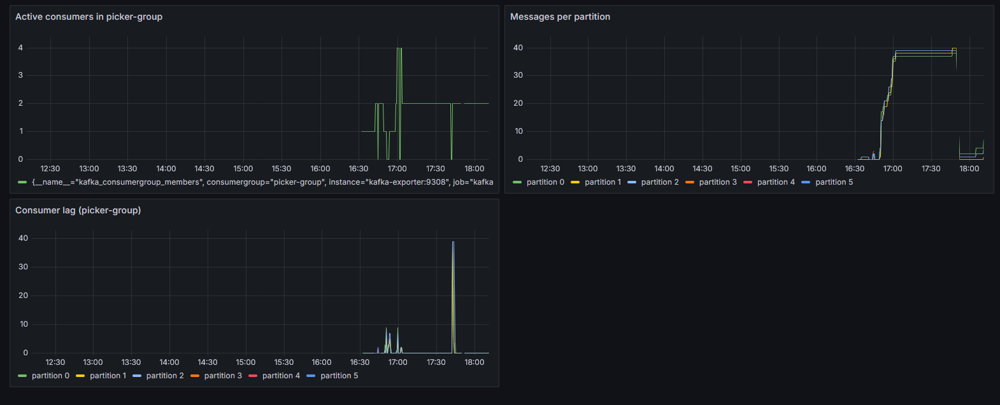

### Три алерта

1. KafkaBrokerDown

```promql
up{job="kafka-exporter"} == 0
```

Что ловит: kafka-exporter (а значит, и Kafka) не отвечает более 1 минуты.

Чем грозит: producer'ы не могут писать, consumer'ы не могут читать. Все заказы перестают обрабатываться. Это критичный инцидент, требует немедленного вмешательства.

Почему эта метрика: базовый health-check. Без работающей Kafka вся система асинхронной обработки стоит.

2. ConsumerGroupLagHigh

```promql
sum(kafka_consumergroup_lag{consumergroup="picker-group"}) > 100
```

Что ловит: суммарный lag группы `picker-group` превысил 100 сообщений и держится 2 минуты.

Чем грозит: заказы копятся быстрее, чем обрабатываются. Причины: мало consumer'ов, медленная обработка, всплеск заказов. Клиенты получат заказ с задержкой. Если lag растёт бесконтрольно - задержка станет неприемлемой.

Почему эта метрика: lag - главный индикатор здоровья consumer'ов. По нему видно, справляется ли система с нагрузкой.

3. NoActiveConsumers

```promql
kafka_consumergroup_members{consumergroup="picker-group"} == 0
```

Что ловит: в группе `picker-group` нет ни одного активного consumer'а более 1 минуты.

Чем грозит: никто не обрабатывает заказы. Сообщения накапливаются в топике. Это тихий инцидент: producer'ы пишут, никто не читает, lag растёт. Без этого алерта можно узнать о проблеме только когда lag вырастет до тысяч.

Почему эта метрика: потребители - "рабочие руки" системы. Если их нет, всё останавливается, но не сразу заметно. Этот алерт ловит проблему раньше, чем lag-алерт.

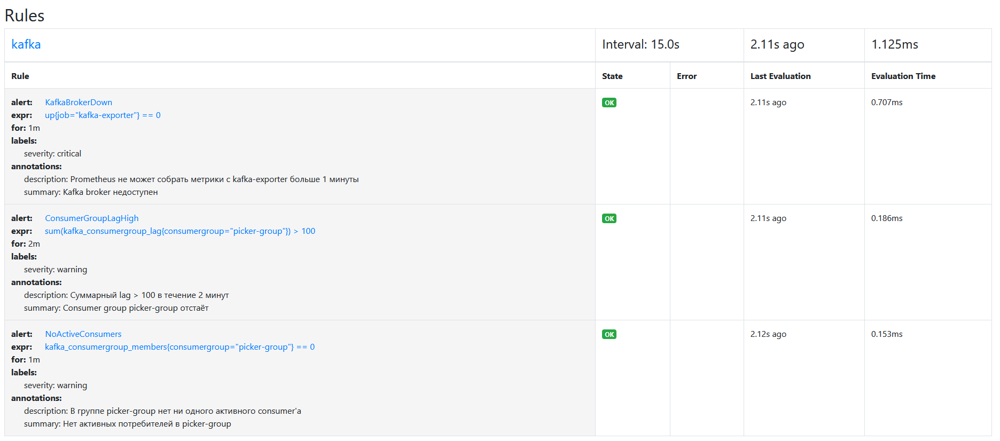

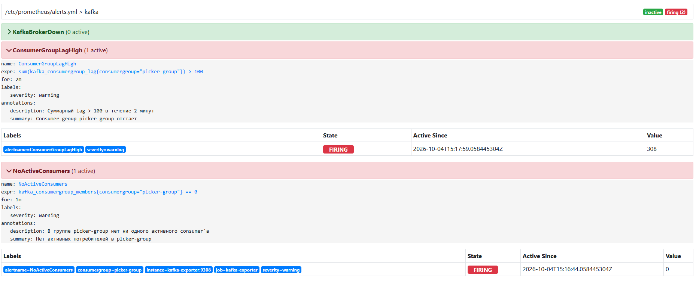

## Как запустить

```bash
# 1. Общая сеть (один раз)
docker network create monitoring-net

cd lab-4
docker compose up -d --build

docker compose ps
```

### Подключение к серверу

Если стек развёрнут на удалённом сервере:

```bash
ssh -L 18001:localhost:8001 \
    -L 18002:localhost:8002 \
    -L 18080:localhost:8080 \
    -L 19308:localhost:9308 \
    -L 19090:localhost:9090 \
    -L 13000:localhost:3000 \
    -L 19093:localhost:9093 \
    -L 19100:localhost:9100 \
    -L 13100:localhost:3100 \
    user@server
```

| Сервис | Адрес |
|--------|-------|
| user-service | http://127.0.0.1:18001 |
| picker-service | http://127.0.0.1:18002 |
| Kafka UI | http://127.0.0.1:18080 |
| kafka-exporter | http://127.0.0.1:19308 |
| Prometheus | http://127.0.0.1:19090 |
| Grafana | http://127.0.0.1:13000 (admin/admin) |
| Alertmanager | http://127.0.0.1:19093 |
